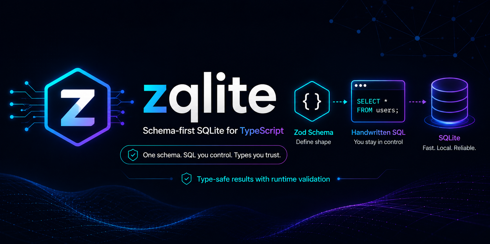

# zqlite

<p align="center">
  
</p>

Schema-first SQLite for TypeScript. Write your Zod schema once and get the table
definition, the types, and validated queries out of it. You still write the
SQL — zqlite just makes sure what goes into the database and what comes back both
line up with your schema.

```ts
import { z } from 'zod'
import { defineQuery, zodToSqliteDDL } from 'zqlite'

const SessionSchema = z.object({
  session_id: z.string(),
  model: z.string(),
  total_tokens: z.number().int(),
  is_active: z.boolean(),
})

// CREATE TABLE, derived from the schema
const ddl = zodToSqliteDDL({
  table: 'sessions',
  schema: SessionSchema,
  primaryKey: ['session_id'],
})

// Params validated going in, rows coerced + validated coming out
const findSession = defineQuery({
  db,
  params: z.object({ session_id: z.string() }),
  result: SessionSchema,
  sql: 'SELECT * FROM sessions WHERE session_id = $session_id',
})

const session = findSession.one({ session_id: 'abc' })
// session: Session | null — is_active is a real boolean, not 0
```

## Why bother

The usual way to talk to SQLite from TypeScript is `db.prepare(...).get(...)`
with an `as YourType` cast stuck on the end. That's fine right up until it
isn't: a column changes type, a boolean comes back as `0`, a JSON column shows
up as a string. The cast swears everything's fine. It isn't, and you find out at
runtime — usually in production.

zqlite makes the schema the one source of truth. The same Zod object gives you
the TypeScript types, the `CREATE TABLE`, and the validation on both ends: params
get checked before they're bound, rows get checked before they're handed back.
The annoying conversions happen for you — `0`/`1` to `boolean`, ISO strings to
`Date`, JSON text to parsed objects, and back again.

And it's deliberately not an ORM. No entities, no relations, no query builder to
learn. You write the SQL; zqlite just owns the boundary around it.

## Docs

| Guide | For |
|---|---|
| **[Getting started](./docs/getting-started.md)** | Zero to a working table in about five minutes |
| **[Recipes](./docs/recipes.md)** | The task-by-task stuff: writes, dynamic queries, JSON, migrations, drivers |
| **[API reference](./docs/api-reference.md)** | Every export, option, and error |
| **[Examples](./examples)** | Runnable and numbered — `bun examples/01-quickstart.ts` |

## Install

Quick heads-up: it's not on npm yet — the first release is close. Until then it's
source-only, so clone the repo or pin it from git if you want to try it. Once
it's published the commands will be the boring ones you'd expect:

```bash
bun add zqlite zod                       # Bun — bun:sqlite is built in
npm install zqlite zod better-sqlite3    # Node
```

You'll need a SQLite driver (see below) and [Zod](https://zod.dev) 4 — it's a
peer dependency.

## Drivers

zqlite isn't tied to one driver. Anything that satisfies the `SqliteAdapter`
shape works; here's what's tested:

| Driver | Status | Notes |
|---|---|---|
| [`bun:sqlite`](https://bun.sh/docs/api/sqlite) | **Tested** | Pass `new Database(path)` straight in |
| [`better-sqlite3`](https://github.com/WiseLibs/better-sqlite3) | **Tested** | Set `paramPrefix: ''` on the connection |
| [`node:sqlite`](https://nodejs.org/docs/latest/api/sqlite.html) (Node 22+) | **Tested** | Thin wrapper — it has no `.transaction()` |
| [`libsql`](https://github.com/tursodatabase/libsql) (local) | **Tested** | Thin wrapper — `paramPrefix: ''` and strip its `_metadata` field; runs on Bun and Node |

Every one of these runs the same integration suite in CI — `bun:sqlite` and
`libsql` under Bun, and `better-sqlite3`, `node:sqlite`, and `libsql` under Node
22 and 24. (`better-sqlite3` is Node-only; Bun won't load its native addon.
`libsql` is the one that runs on both.)

The four drivers above are **synchronous**. **Turso cloud** — remote over HTTP —
is reached through the separate **async API** (`defineAsyncQuery`,
`defineAsyncWrite`, `execWriteAsync`) over
[`@libsql/client`](https://github.com/tursodatabase/libsql-client-ts). Same
schema, same validation and coercion — the calls just return Promises. See
[recipes.md → Async & Turso cloud](./docs/recipes.md#async--turso-cloud).

Wrapper snippets for each driver live in
[recipes.md → Multiple drivers](./docs/recipes.md#multiple-drivers).

## What it doesn't do

- **Named params only.** SQL uses `$name` placeholders. Positional `?` isn't
  supported, and zqlite will tell you at define time if you reach for it.
- **Flat schemas.** Nested `ZodObject` / `ZodArray` fields need `zJsonSchema` —
  they aren't auto-flattened. That's on purpose, so JSON columns are visible in
  the schema instead of sneaking in.
- **No index generation.** Define your indexes alongside the `zodToSqliteDDL`
  output.
- **Sync by default, async when you need it.** The four synchronous drivers use
  the synchronous API (`defineQuery` / `defineWrite` / `execWrite`). Remote Turso
  cloud uses the parallel async API (`defineAsyncQuery` / `defineAsyncWrite` /
  `execWriteAsync`) — same core, Promise-returning. There's no single "make
  everything async" switch; the two surfaces stay separate on purpose.

## Status

Pre-1.0, and not on npm just yet — but it's not vaporware. The API's stable, and
the whole thing runs a cross-driver suite in CI on every push (four drivers, two
runtimes), so it's safe to build on. Pin a version once it's published. Anything
that breaks between versions gets written down in [CHANGELOG.md](./CHANGELOG.md).